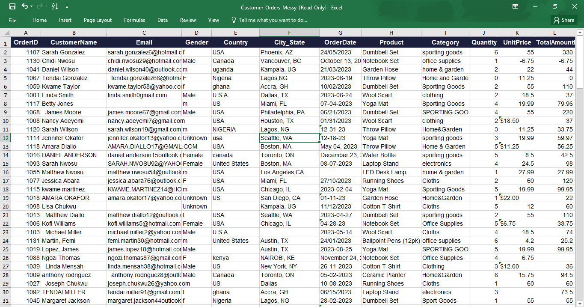
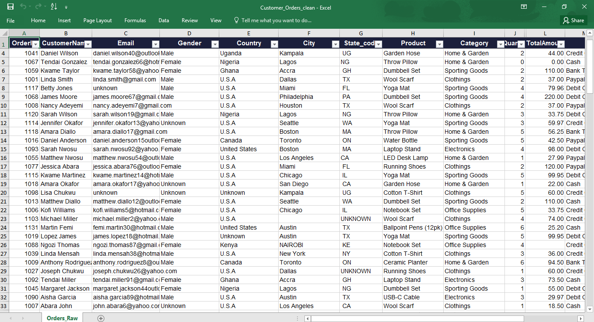

# Excel Customer Orders Data Cleaning

## 📌 Project Overview

This project focuses on cleaning and preparing a messy customer orders dataset using Microsoft Excel.

The goal was to identify data-quality issues, apply appropriate cleaning techniques, standardize the data, and transform the dataset into a structured and analysis-ready format.

## 🎯 Project Objective

To demonstrate practical data-cleaning skills using Microsoft Excel and prepare raw customer order data for further analysis and reporting.

##  Dataset

The dataset contains customer order information, including:

* Order ID
* Customer Name
* Email
* Gender
* Country
* City/State
* State Code
* Product
* Category
* Quantity
* Unit Price
* Total Amount
* Payment Method
* Order Status
* Notes

## 🧹 Data Cleaning Performed

The dataset was reviewed and cleaned to improve its quality, consistency, and usability.

Key cleaning activities included:

* Identifying and handling missing values
* Cleaning customer names
* Extracting customer names from email addresses where required
* Removing unnecessary spaces
* Standardizing text values
* Cleaning and standardizing gender categories
* Checking phone number formatting
* Converting values stored as text into appropriate formats
* Standardizing dates
* Reviewing inconsistent or incomplete records
* Checking the dataset for duplicates and data inconsistencies

## 🛠️ Tools & Techniques

**Tool:**

* Microsoft Excel

**Techniques:**

* Excel formulas
* Text functions
* Data formatting
* Data validation
* Find & Replace
* Sorting and filtering
* Data quality checks

## 📊 Before & After

### Before Cleaning

The original dataset contained several data-quality issues, including missing values, inconsistent formatting, and inconsistencies in some fields.

### After Cleaning

After applying data-cleaning techniques in Microsoft Excel, the dataset was transformed into a cleaner and more structured format suitable for further analysis.

The project started with a messy customer orders dataset containing inconsistencies and data-quality issues.

After applying the cleaning process, the dataset was transformed into a more consistent and structured format that can be used for further analysis and visualization.

## 💡 Key Learning

This project strengthened my understanding of the importance of data quality in data analytics.

I learned that before analyzing data or creating dashboards, it is important to first ensure that the data is accurate, consistent, complete, and properly formatted.

## 🚀 Future Analysis

The cleaned dataset can be used for further analysis such as:

* Sales performance analysis
* Customer analysis
* Product performance analysis
* Revenue analysis
* Order-status analysis
* Geographic analysis
* Power BI dashboard development

## 👩🏽‍💻 Author

**Patience Joan**

Aspiring Data Analyst

**Skills:** Excel | SQL | Power BI | Python
